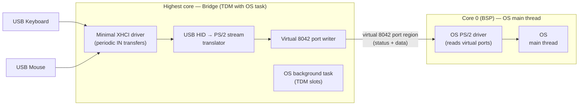
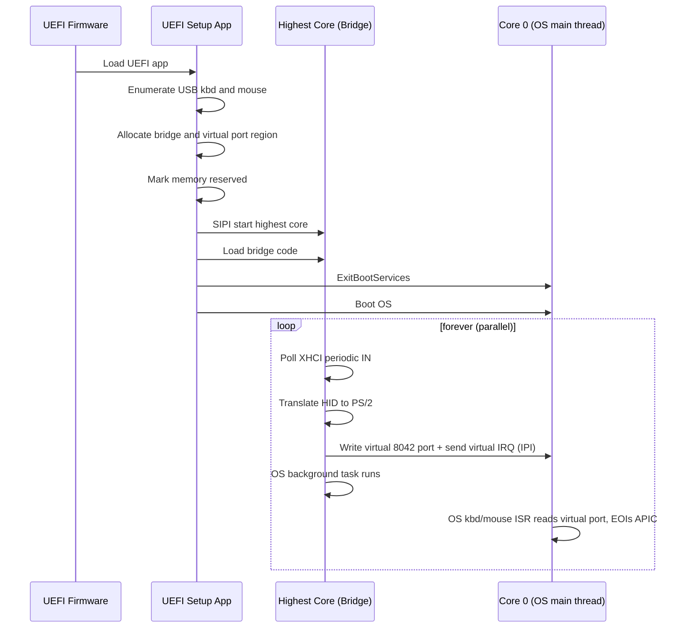

# USB HID → Virtual 8042 Port Bridge
## OS-Independent Architecture for USB Keyboard & Mouse on a PS/2-Only OS

**Document version:** 1.4 (Layer 2 done + performance analysis)
**Status:** Approved
**Author:** Principal Software Architect
**Target hardware:** Modern UEFI PC, exactly one USB keyboard + one USB mouse, fixed topology (no hotplug, no other USB devices ever)
**Scope:** OS-independent — any OS that implements the documented virtual 8042 port ABI can be loaded.

---

## 1. Problem Statement

A modern UEFI PC has only USB keyboard and mouse. We must run an OS whose input path
accepts a **PS/2-style serial keyboard/mouse interface** (a byte stream driven by the
OS's existing keyboard/mouse ISRs), without adding any USB code to that OS's source,
and without modifying firmware.

The solution is a **standalone bridge** that runs on a dedicated CPU core, reads the USB
HID devices, translates their reports into a standard PS/2 byte stream, and delivers it
to the OS through a **virtual 8042 port region** in shared memory, plus a **virtual
interrupt** that triggers the OS's existing ISR-driven input path. The OS reads the
virtual status/data registers from its keyboard/mouse ISRs — replacing its
`in 0x60`/`in 0x64` instructions with loads from fixed addresses — so **no per-OS input
adapter is required**.

---

## 2. Requirements & Constraints

| # | Constraint | Implication |
|---|-----------|-------------|
| C1 | **No USB code in the OS codebase/source.** Code loaded into memory does not count as modifying the OS | USB code lives only in loaded components (the bridge). The OS source is untouched |
| C2 | Loadable on **any modern PC, including locked-down firmware** | No firmware reflash, no SMM install, no reliance on VT-x/AMD-V |
| C3 | **Minimal code** | Avoid a full USB stack; avoid 8042/PS-2 emulation and I/O-port trapping. The virtual IRQ is a software IPI (the OS's own primitive), not hardware emulation |
| C4 | OS input path may be adapted via a lightweight **serial** interface (non-USB) | The OS's PS/2 driver reads the virtual port region from its existing ISRs and feeds its existing input handlers |
| C5 | **Standalone bridge** — runs in its own process/thread, separate from the OS | A distinct execution context, not code inside the OS |
| C6 | **XHCI ≥ 1.0 only** — the USB host controller must be an XHCI controller at spec version 1.0 or later | The bridge drives XHCI directly. No EHCI/UHCI/OHCI support. XHCI 1.0+ is universal on modern PCs. **Note:** this is about the *controller spec version*, not about USB 3.0 SuperSpeed — keyboards/mice are low/full-speed devices and never use SuperSpeed |

---

## 3. OS Independence

The bridge is **not** OS-specific. It presents a **standard, documented virtual 8042
port ABI** — a "virtual serial keyboard/mouse interface" — that any OS can consume. The
OS-specific surface is limited to replacing its `in 0x60`/`in 0x64` reads with loads
from the virtual port region.

| Layer | OS-independent? | What it is |
|-------|-----------------|------------|
| **Bridge** (B1–B5, highest core) | ✅ Yes | Reads USB HID, translates to PS/2 Set 1 + PS/2 mouse packets, writes the virtual 8042 port region. Knows nothing about the OS |
| **Virtual 8042 port ABI** (§6) | ✅ Yes | The formal interface contract: a shared-memory region mirroring the 8042 status/data registers. This is the "serial keyboard/mouse interface" any OS targets |
| **Core scheduling** (TDM slot on highest core) | ✅ Yes (mechanism) | The bridge occupies a periodic TDM slot on the highest core. Which OS task runs in the other slots is OS-specific, but the bridge does not care |
| **OS input read** (replaces `in 0x60`/`in 0x64`) | ❌ Per-OS | The small, swappable change: the OS's PS/2 driver reads the virtual status/data registers instead of the real 8042 ports. One per OS |

**Key consequence:** to load a *different* OS, you do **not** touch the bridge or the
USB path. You only adapt that OS's PS/2 driver to read the virtual port region. The
bridge and the virtual port ABI are reused unchanged.

**What "same serial keyboard/mouse interface" means:** the virtual port region delivers
a byte stream in a fixed, documented format — PS/2 Set 1 scancodes for the keyboard,
3-byte PS/2 packets for the mouse — and the virtual IRQ triggers the OS's existing
keyboard/mouse ISRs. Any OS whose input layer reads that byte stream from its ISRs can
be loaded.

**Per-OS contract** — the three things each OS must provide:
1. **Reserve** the bridge + virtual port region so the OS never allocates over it
   (mechanism is OS-specific, e.g. an E820 carve-out).
2. **Leave the highest core available** to the bridge's TDM slot (or, on a single-core
   target, tolerate the TDM context switch on core 0).
3. **Read the virtual port region** from its keyboard/mouse ISRs instead of the real
   8042 ports: replace `in 0x60` / `in 0x64` with loads from the virtual data/status
   addresses, **read-and-clear** the status bit when consuming a data byte, and **EOI
   the local APIC** in the ISR (the virtual IRQ is APIC-sourced; see §6).

These three are the entire per-OS surface. Everything else is shared.

---

## 4. Architectural Decision

**The bridge runs on the highest-numbered core, time-division-multiplexed with the OS's
task on that core, while the OS's main thread runs on core 0.**

Because the target OS is SMP, the highest core already hosts a background task; the
bridge shares that core in its own TDM slots rather than trying to exclude it. This
gives the OS's main thread full, uninterrupted use of core 0. The bridge polls the USB
HID devices and writes input events into a **virtual 8042 port region** in shared memory
that the OS's PS/2 driver reads directly.



### 4.1 Why this satisfies every constraint

- **C1 (no USB in OS codebase):** All USB code lives in the loaded bridge on the
  highest core. The OS source is untouched.
- **C2 (any PC, locked-down firmware):**
  - No firmware modification (no SPI reflash).
  - No SMM driver — SMRAM is locked on locked-down systems, so SMM is unusable.
  - No hypervisor — VT-x/AMD-V may be disabled, and it is the heaviest option.
  - Multi-core x86 is **universal** on modern PCs. Starting the highest core via SIPI
    is a standard CPU operation that firmware locking cannot prevent.
  - Secure Boot only affects *loading* the UEFI setup app (sign/enroll a key). The
    bridge itself runs after `ExitBootServices` and is not subject to Secure Boot.
  - XHCI ≥ 1.0 is **universal** on modern PCs (all USB 3.x controllers are XHCI 1.0+),
    so the C6 requirement does not meaningfully narrow the target set.
- **C3 (minimal code):** Fixed topology lets us enumerate once via UEFI and only do
  periodic IN transfers at runtime. Because the OS input path is a serial interface
  driven by its existing ISRs, we **do not** need to emulate the 8042/PS-2 controller
  or trap I/O ports. The virtual port region is a tiny shared-memory mirror of the
  8042's two registers, and the virtual IRQ is a software IPI (the OS's own primitive),
  not hardware emulation.
- **C4 (serial interface):** The virtual 8042 port region is the lightweight serial
  interface, and the virtual IRQ triggers the OS's existing keyboard/mouse ISRs. The
  OS's existing PS/2 driver reads it directly from its ISRs — no separate adapter
  component is needed.
- **C5 (standalone = own process/thread):** The bridge runs on the **highest core**,
  time-division-multiplexed with the OS's task on that same core. It is a separate
  execution context from the OS main thread (which stays on core 0), giving the bridge
  its own thread of control without stealing CPU from the main thread.
- **C6 (XHCI ≥ 1.0 only):** The bridge drives the XHCI controller directly. Restricting
  to XHCI ≥ 1.0 lets B1 target a single, well-defined controller interface (doorbell,
  TRB rings, event ring) with no EHCI/UHCI/OHCI code paths — a direct contributor to
  C3 (minimal code). **No USB 3.0 SuperSpeed support is needed:** keyboards and mice are
  low-speed (1.5 Mb/s) or full-speed (12 Mb/s) devices that always enumerate on the
  XHCI's USB 2.0 root-hub ports and use interrupt endpoints. The bridge only drives the
  two pre-discovered low/full-speed interrupt endpoints and never touches SuperSpeed.
  The XHCI ≥ 1.0 requirement is about the *controller interface version*, not about
  SuperSpeed — every modern XHCI controller is 1.0+ and handles both USB 2.0 and 3.0
  traffic, so this does not narrow the target set.

### 4.2 Why the highest core, not core 0

TDM on core 0 would steal time from the OS main thread on every tick. Putting the
bridge on the highest core and TDM-ing it with the background task there keeps core 0
entirely to the main thread. This is the core goal: give the main thread more breathing
room.

The bridge core is **not** reserved exclusively for the bridge — the OS's background
task continues to run there in its own TDM slots. Only the OS main thread is pinned to
core 0 and never runs on the bridge core.

**Mechanism:** the bridge owns the timer on the highest core. On each tick the ISR
switches between the bridge context and the OS task context (save/restore registers +
stack). Round-robin TDM with fixed slots gives the bridge guaranteed CPU time to poll
USB and write into the virtual port region, while the OS task keeps the rest.

**Single-core fallback:** if a target has only one core, the same TDM mechanism runs on
core 0, sharing with the OS main thread. Modern PCs are multi-core, so the highest-core
TDM design is the primary path.

### 4.3 Why the alternatives fail

| Option | Fails because |
|--------|---------------|
| SMM driver (Legacy-USB-style) | SMRAM locked on locked-down firmware; chipset-specific; cannot install after ReadyToLock |
| Hypervisor with virtual 8042 | Needs VT-x/AMD-V (may be disabled); heaviest; not bare metal |
| USB HID driver inside OS | Forbidden (C1) — would be an OS codebase change |
| External MCU → serial hardware | Needs a physical serial port (being removed from modern PCs); not pure software |
| UEFI runtime driver | Permissible under clarified C1, but runs on the BSP in the OS's context; not a standalone bridge (C5) |

---

## 5. System Architecture

### 5.1 Two-phase execution

**Phase 1 — Boot-time setup (UEFI application, before `ExitBootServices`):**
1. **Verify the host controller is XHCI ≥ 1.0 (C6).** Check the XHCI spec version
   (`HCSPARAMS1`/`HCCPARAMS` capability registers, or the `EFI_USB2_HC_PROTOCOL`
   revision). Abort cleanly if not XHCI ≥ 1.0 — no EHCI/UHCI/OHCI fallback.
2. Enumerate the single USB keyboard and single USB mouse using the standard UEFI USB
   stack (`EFI_USB2_HC_PROTOCOL` / `EFI_USB_IO_PROTOCOL`).
3. Record the fixed topology: device addresses, configurations, interfaces, and the
   interrupt IN endpoints for each device. **Done once** — no runtime enumeration.
4. Determine the core count (CPUID leaf 0xB / ACPI MADT) and pick the highest-numbered
   core as the bridge core.
5. Allocate the bridge code region and the virtual 8042 port page, and mark them
   `EFI_RESERVED_MEMORY_TYPE` in the EFI memory map so the OS will not allocate over them.
6. Set up the bridge core's GDT, stack, and page tables, load the bridge code, and start
   the core via SIPI. The OS's PS/2 driver reads the virtual port region on core 0.
7. Hand off to the bootloader / OS on the BSP (core 0).

**Phase 2 — Runtime (after `ExitBootServices`):**
- **Bridge (highest core, TDM with OS task):** runs in its own TDM time slot on the
  highest core — reads HID reports from the fixed endpoints via a minimal XHCI driver,
  translates to PS/2 scancodes / mouse packets, writes to the virtual 8042 port region.
  The OS's background task runs on that core in the remaining slots.
- **Main input path (core 0):** the OS's PS/2 driver reads the virtual status/data
  registers and feeds the existing keyboard/mouse input handlers. The OS main thread
  keeps the full core 0.

### 5.2 Why the virtual port presents a "virtual PS/2 stream"

The input-side change is kept tiny by making the virtual port deliver data in the **exact
format the OS already expects**:
- **Keyboard:** PS/2 **Set 1** scancodes (make/break bytes).
- **Mouse:** PS/2 mouse packets (3 bytes: buttons + dx + dy).

The OS's existing scancode→key and mouse-packet→motion logic is reused **unchanged**.
Only the low-level byte source changes from the 8042 ports (`0x60`/`0x64`) to the
virtual port region. This minimizes both the input-side change and the bridge-side
translation (HID→PS/2 Set 1 is a well-defined, small mapping table).

---

## 6. Interface Specification — Virtual 8042 Port Region + Virtual IRQ (the OS-agnostic ABI)

This is the **formal interface contract** that makes the solution OS-independent. Any
OS that reads the virtual port region can be loaded. The bridge is the producer; the
OS's PS/2 driver is the consumer. The ABI is fixed and versioned — the bridge and the
OS must agree on it, but neither depends on the other's OS.

A small shared-memory region in the reserved area that **mirrors the real 8042
controller's two I/O registers**, plus a **virtual interrupt** that triggers the OS's
existing ISR-driven input path:

```c
#define VIRTUAL_PS2_BASE    0x10000030u   /* fixed physical address */
#define VIRTUAL_PS2_STATUS  (VIRTUAL_PS2_BASE + 0)   /* U8, mirrors 0x64 */
#define VIRTUAL_PS2_DATA    (VIRTUAL_PS2_BASE + 1)   /* U8, mirrors 0x60 */

#define VIRTUAL_PS2_STAT_KBD    0x01u   /* bit0: keyboard output buffer full */
#define VIRTUAL_PS2_STAT_MOUSE  0x20u   /* bit5: mouse output buffer full */
#define VIRTUAL_PS2_STAT_ANY    (VIRTUAL_PS2_STAT_KBD | VIRTUAL_PS2_STAT_MOUSE)

/* Virtual IRQ vectors: the bridge delivers an IPI on the SAME vector the OS
   already uses for that device, so the OS's existing ISR fires and reads the
   virtual data port. (Reference OS vectors: IRQ1 = 0x21 kbd, IRQ12 = 0x2C mouse.) */
#define VIRTUAL_PS2_IRQ_KBD    0x21u
#define VIRTUAL_PS2_IRQ_MOUSE  0x2Cu
```

**Faithful 8042 semantics (verified against the reference OS source):**
- **BOTH keyboard and mouse data arrive through the SINGLE data register** (0x60),
  disambiguated by the status register bits (bit0 = keyboard, bit5 = mouse). This
  mirrors the real 8042, where the keyboard and mouse share one output buffer.
- **Only ONE byte is in flight at a time.** The bridge writes a byte, sets the status
  bit, and does not write the next byte until the OS has consumed it (status bit clear).
- **Keyboard is prioritized over mouse** (matches the OS's poll order).

**Producer (bridge core, highest core):**
```c
/* write one byte, make it visible, set the "ready" flag, then fire the
   virtual IRQ so the OS's ISR for that device reads the byte */
virtual_ps2_write_data(byte);
mfence();
virtual_ps2_set_status(VIRTUAL_PS2_STAT_KBD);   /* or _MOUSE */
virtual_ps2_send_irq(VIRTUAL_PS2_IRQ_KBD);      /* or _MOUSE */
```

**Consumer (OS PS/2 driver, core 0) — ISR-driven:**
```c
/* In the OS's keyboard ISR (vector 0x21) / mouse ISR (vector 0x2C), which the
   bridge's virtual IRQ triggers: read the data byte, READ-AND-CLEAR the status
   bit (a pure load does NOT clear it, unlike the real 8042 hardware), feed the
   byte to the OS's existing handler, then EOI the local APIC. */
byte = virtual_ps2_read_data();
virtual_ps2_clear_status(VIRTUAL_PS2_STAT_KBD);   /* or _MOUSE */
/* feed byte to the OS's keyboard/mouse handler */
adapter_apic_eoi();   /* see below */
```

**Byte stream semantics (virtual PS/2) — the "serial keyboard/mouse interface":**
- **Keyboard:** PS/2 **Set 1** scancodes, make and break (`0xE0`-prefixed extended
  codes included). The OS reuses its existing Set 1 decoder.
- **Mouse:** 3-byte packets `[buttons, dx, dy]` (two's-complement deltas), matching
  the standard PS/2 mouse packet the OS already parses.

Because both device classes share the single data register, the OS disambiguates them
by the status bits — exactly as it does with the real 8042. The bridge writes a keyboard
byte with `STAT_KBD` set and a mouse byte with `STAT_MOUSE` set.

**Ordering (cross-core):** The bridge (core N) and the OS (core 0) are on different
cores. x86 is cache-coherent (MESI), so the shared region is coherent. The `mfence` on
the producer (before setting the status bit) ensures the data byte is visible before the
"ready" flag. The virtual IRQ is sent only after the status bit is set, so when the OS's
ISR fires the data is already visible. No locks.

**The virtual IRQ (the ISR-driven path):** The reference OS (TempleOS) drives
keyboard/mouse input **primarily from ISRs** — `IRQKbd` (0x21) and `IRQMsHard` (0x2C)
read the data port; the polled path (`KbdMsHndlr`) is only a fallback gated on
`!irqs_working`. To use that ISR path on a USB-only machine, the bridge delivers a
**virtual interrupt**: after writing a byte and setting the status bit, it sends an
inter-processor interrupt (IPI) via the local APIC ICR to the OS core on the **same
vector** the OS already uses for that device. The OS's existing ISR fires and reads the
virtual data port. This is exactly the reference OS's own software-IPI primitive
(`MPInt`), reused by the bridge.

**The one OS-side accommodation (APIC EOI):** a real 8042 IRQ is **PIC-sourced**, so the
OS's ISRs EOI the 8259 PIC (`OutU8(0x20,0x20)`). A virtual IRQ is **APIC-sourced** (an
IPI), so the ISR must **also EOI the local APIC** (write 0 to the LAPIC EOI register).
This is a one-line addition per ISR — smaller than suppressing the IRQ path and using
the polled fallback, and faithful to the OS's actual ISR-driven architecture.

**The honest minimal OS change (read-and-clear + APIC EOI):** on the real 8042, reading
the data port (0x60) automatically clears the output-buffer-full status bit. A pure load
from `VIRTUAL_PS2_DATA` does **not** clear it. So the OS's data read must be a **read-and-
clear** — load the byte, then clear the status bit. This is 2 lines per data-read site,
plus the one-line APIC EOI in the ISR. It reuses 100% of the OS's existing
decoder/parser/PutKey logic.

**ABI stability rules (what makes it OS-independent):**
1. The region layout, register offsets, status bits, byte-stream format, and IRQ vectors
   are **fixed** and documented here. They do not change per OS.
2. The bridge never assumes anything about the OS — it only writes bytes, sets status
   bits, and sends the virtual IRQ.
3. The OS never assumes anything about the bridge — it only reads status/data, clears
   status bits, and EOIs the APIC.
4. The region base address is published by the boot-time UEFI app (a fixed physical
   address, `0x10000030`). Each OS reads it once at startup.

---

## 7. Module Breakdown & Code Tasks

### 7.1 Bridge (highest core, TDM with OS task) — OS-independent

| Module | Responsibility | Relative size |
|--------|----------------|---------------|
| **B1. XHCI periodic-IN driver** | Drive the XHCI controller directly (XHCI ≥ 1.0 only, per C6): doorbell, TRB rings, event ring, periodic interrupt IN transfers on the two pre-discovered **low/full-speed** endpoints. No SuperSpeed support, no enumeration, no hotplug, no hardware interrupts consumed (the bridge polls; it is an interrupt *producer*, not consumer) | Largest (~300–600 LOC) |
| **B2. HID report parser** | Parse boot-protocol keyboard (8-byte report) and mouse (3-byte report) reports | Small |
| **B3. HID → PS/2 Set 1 translator** | Usage → Set 1 scancode table (make/break), mouse buttons/dx/dy → PS/2 packet | Small |
| **B4. Virtual 8042 port writer + IRQ emitter** | 8042-style producer: write one byte to the virtual data register, set the status bit, `mfence` ordering, then send the virtual IRQ (IPI) on the device's vector so the OS's ISR fires. One byte in flight at a time | Tiny |
| **B5. Bridge core entry** | Bridge core entry point and TDM poll loop; runs in its own time slot on the highest core, sharing with the OS's background task | Tiny |

### 7.2 Input side — the OS's PS/2 driver reads the virtual port from its ISRs (NOT an OS source modification)

The input-side change is a **small edit to the OS's PS/2 driver**, not a new component.
The OS's existing scancode/mouse-packet decoder and input queue are reused **unchanged**;
only the low-level byte source changes from the real 8042 ports (`0x60`/`0x64`) to the
virtual port region, and the OS's existing keyboard/mouse ISRs (triggered by the
bridge's virtual IRQ) do the read. The OS source is otherwise untouched.

| Module | Responsibility | OS-specific? | Relative size |
|--------|----------------|--------------|---------------|
| **O1. Virtual port reader (ISR-driven)** | In the OS's keyboard/mouse ISR (triggered by the bridge's virtual IRQ): read the virtual status/data registers, read-and-clear the status bit, feed bytes to the OS's existing KBD/mouse handler, then EOI the local APIC | **Yes** (per-OS) | Tiny |

> **O1 implementation status:** the OS-agnostic core of O1 is implemented in
> `src/adapter/virtual_ps2_reader.c` (read-and-clear + APIC EOI), with the only
> OS-specific part (the feed step) exposed as weak hooks
> (`adapter_feed_kbd_byte` / `adapter_feed_mouse_byte`). It is validated by the Layer 2
> stub harness (`tests/test_layer2_reader.c`). The per-OS wiring (which OS handler the
> feed hooks call) is done in the OS, not this repo.

> **How O1 hooks in without editing source:** the OS's PS/2 driver already reads the
> 8042 ports from its ISRs and feeds its own input queue. Replacing `in 0x60`/`in 0x64`
> with loads from the virtual port region (plus a read-and-clear of the status bit and a
> one-line APIC EOI) reuses that path entirely. The bridge's virtual IRQ triggers the
> OS's existing ISR, so the ISR-driven path works without the real 8042 producing IRQs.
> This is a minimal, well-scoped edit to the OS's PS/2 driver — the absolute-minimum OS
> change.

### 7.3 Boot-time (UEFI application) — OS-independent

| Module | Responsibility | Relative size |
|--------|----------------|---------------|
| **U1. USB topology discovery** | Verify host controller is XHCI ≥ 1.0 (C6); use UEFI USB stack to find kbd+mouse, record endpoints | Small |
| **U2. Highest-core bring-up** | Determine core count (CPUID leaf 0xB / ACPI MADT); set up the highest core's GDT, stack, page tables; start it via SIPI, loading the bridge code | Small |
| **U3. Memory reservation** | Allocate bridge + virtual port region, mark reserved in EFI memory map | Tiny |

---

## 8. Boot Sequence



---

## 9. Risks & Verification

| Risk | Mitigation / Verification |
|------|---------------------------|
| OS overwrites bridge/virtual-port RAM | Mark region `EFI_RESERVED_MEMORY_TYPE` **and** carve it out of the memory map the OS collects (e.g. E820 for TempleOS). Place bridge/virtual-port region above the OS's physical memory space so it never allocates over it |
| OS main thread uses the bridge core | The bridge **TDM-shares** the highest core with the OS's background task there — no need to exclude the core from the OS's core count. The main thread stays on core 0 and never runs on the bridge core |
| Highest-core bring-up fails | **Verify** SIPI sequence, GDT/stack/page tables for the AP; test in QEMU with multiple cores |
| XHCI periodic-IN without runtime enumeration | Enumerate once via UEFI (Phase 1); **verify** endpoint addresses remain valid after `ExitBootServices` |
| Secure Boot blocks UEFI app | Sign the app or enroll a key (deployment concern, not architectural) |
| Target lacks XHCI ≥ 1.0 | **Hard requirement (C6):** only XHCI ≥ 1.0 is supported. Verify the controller's spec version (XHCI `HCSPARAMS1`/`HCCPARAMS`, or the UEFI `EFI_USB2_HC_PROTOCOL` revision) at boot; abort cleanly if not XHCI ≥ 1.0. No EHCI/UHCI/OHCI fallback |
| Cross-core ordering bugs in virtual port | `mfence` producer before setting the status bit; single byte in flight; unit-test on host |
| OS ISR does not EOI the local APIC | The virtual IRQ is APIC-sourced (an IPI), so the OS's ISR must EOI the local APIC (write 0 to the LAPIC EOI register) in addition to the PIC EOI it already does. This is a one-line addition per ISR (§6, §9.1) |
| OS independence not preserved | The bridge + virtual port ABI are OS-agnostic (§3, §6). Only the OS's PS/2 driver read is per-OS. To load a new OS, adapt its PS/2 driver to read the virtual port — never touch the bridge or ABI. Verify the ABI is stable and versioned |
| OS data read does not clear the status bit | The OS's data read must be a **read-and-clear** (load the byte, then clear the status bit). A pure load does not clear it, unlike the real 8042. This is the honest minimal OS change (§6) |

### 9.1 Reference verification (TempleOS)

The design was verified against the TempleOS source (`cia-foundation/TempleOS`) as the
reference consumer of the virtual 8042 port ABI:

- **Input path — CONFIRMED.** `Keyboard.HC` reads raw bytes from `KBD_PORT` (0x60) and
  converts them to scancodes via `NORMAL_KEY_SCAN_DECODE_TABLE` (**PS/2 Set 1**) with
  `0xE0` extended handling. `Mouse.HC` parses **3-byte packets** `[buttons, dx, dy]`
  with two's-complement sign handling. `KeyDev.HC` `PutKey(ch, sc)` is the input
  injection point. The virtual PS/2 stream design is consistent — only the byte source
  changes (0x60/0x64 → virtual port region).
- **Single data register — CONFIRMED.** Both keyboard and mouse read the **same** data
  port `KBD_PORT` (0x60), disambiguated by the status register `KBD_CTRL` (0x64) bits
  (bit0 = keyboard, bit5 = mouse). Read sites: `KbdPktRead()`, `KbdCmdRead()`,
  `KbdCmdFlush()`, `MsHardPktRead()` all read `InU8(KBD_PORT)`; `KbdMsHndlr()` polls
  `InU8(KBD_CTRL)&1` then drains. This confirms the virtual port must use a **single
  data slot** with status bits, not separate kbd/mouse slots.
- **ISR-driven path is PRIMARY — CONFIRMED.** TempleOS drives keyboard/mouse input
  **primarily from ISRs**: `IRQKbd` (vector 0x21 / IRQ1) and `IRQMsHard` (vector 0x2C /
  IRQ12) read the data port. The polled path (`KbdMsHndlr`) is only a **fallback** gated
  on `!irqs_working`. So the design delivers a **virtual IRQ** (an IPI via the local
  APIC ICR) on those same vectors to trigger the OS's existing ISRs — not the polled
  fallback.
- **Virtual IRQ mechanism — CONFIRMED.** TempleOS's own software-IPI primitive
  `MPInt(U8 num, I64 cpu_num)` writes the local APIC ICR (`ICR_HIGH = mp_apic_ids[cpu]<<24`,
  `ICR_LOW = 0x4000+num`) to deliver an interrupt to a specific core. The bridge reuses
  this exact mechanism to deliver the virtual IRQ to core 0 on the device's vector.
- **APIC EOI accommodation — REQUIRED.** A real 8042 IRQ is **PIC-sourced**, so
  `IRQKbd`/`IRQMsHard` EOI the 8259 PIC (`OutU8(0x20,0x20)`). A virtual IRQ is
  **APIC-sourced** (an IPI), so the ISR must **also EOI the local APIC** (write 0 to the
  LAPIC EOI register, as `IntNop()`/`IRQ_TIMER` do). This is a one-line addition per ISR
  — the honest, minimal OS-side accommodation for the virtual IRQ design.
- **Read-and-clear — REQUIRED.** On the real 8042, reading the data port clears the
  output-buffer-full status bit. A pure load from the virtual data slot does **not**
  clear it, so the OS's data read must be a **read-and-clear** (load the byte, then
  clear the status bit) — 2 lines per data-read site, not 1. This is the honest minimal
  OS change.
- **Multi-core — CONFIRMED SMP.** TempleOS is SMP (`mp_cnt`, `cpu_structs[]`,
  `CoreAPSethTask()` on every AP core, `JobQue`/`Spawn` with `target_cpu`). The bridge
  TDM-shares the highest core with the Seth task there; no `mp_cnt` exclusion needed.
- **Memory — PARTIALLY VERIFIED.** TempleOS boots via its own BIOS bootloader and
  collects the **E820** map, not the UEFI map. So `EFI_RESERVED_MEMORY_TYPE` alone is
  **not sufficient**; the region must also be carved out of E820 or placed above
  `mem_physical_space`.

**Testability — OS-free first, verified on real hardware:**

The strategy is to validate **everything except the final OS boot** without loading any
OS, and to verify **each layer on real hardware** — QEMU is for fast iteration, but real
hardware is the source of truth. The OS boot is the last, optional step; most of the
design is proven before it.

**Layer 0 — Host unit tests (no QEMU, no OS):**
- Virtual 8042 port writer + IRQ emitter: single-byte write + status bit, virtual IRQ
  sent after write on the device's vector, keyboard priority, blocked-while-pending,
  consumption handshake, and the B2→B3→B4 pipeline for a key and a mouse move. Run as
  pure C on the host (`tests/test_virtual_ps2.c`).
- HID → PS/2 Set 1 translator: usage → scancode table, make/break, `0xE0` extended
  codes, mouse buttons/dx/dy → 3-byte packet. Run as pure C on the host.
- These cover B2, B3, B4 logic entirely — no hardware, no OS.
- **Real hardware:** the virtual port writer and translator logic is hardware-independent,
  so host tests are authoritative here. No hardware step needed beyond confirming the
  host matches the target's x86 semantics (already true for x86-64).

**Layer 1 — UEFI app + bridge (no OS):**
- **QEMU/OVMF:** boot the UEFI setup app under OVMF. It enumerates the USB kbd/mouse,
  allocates and marks the bridge + virtual port region reserved, and SIPI-starts the
  highest core with the bridge code.
- **OS-free validation:** instead of booting an OS, the app (or a tiny test harness on
  core 0) reads the virtual port region and prints/asserts the received PS/2 byte
  stream. This proves the full USB → XHCI → HID → PS/2 → virtual port path end-to-end,
  with **no OS loaded**. Drive USB input via the QEMU monitor (`sendkey`, mouse events).
- **Real hardware (required):** boot the same UEFI app on a real PC with a real USB
  keyboard and mouse. This is the critical hardware validation — it exercises the real
  XHCI controller, real USB devices, real SIPI bring-up, and real multi-core TDM, none
  of which QEMU fully models. The harness on core 0 reads the virtual port and asserts
  the byte stream, exactly as in QEMU, but against real hardware.
- **UEFI → XHCI handoff (dedicated first test):** the bridge takes over the XHCI
  controller from UEFI in an unknown, partially-configured state. Re-configuring it
  (reset, rings, device contexts, doorbells) is the most failure-prone step, so the
  harness's first test case is specifically the handoff: it verifies the bridge reset
  the controller, re-established the device/endpoint context, and successfully polls
  the two endpoints. B1 records a **structured fault record** (`src/bridge/xhci_fault.h`)
  — stage, register snapshot (`USBSTS`/`USBCMD`/`CRCR`), completion code — so a handoff
  failure is diagnosed precisely (which step, what the controller said) rather than as
  a generic halt. This is where the open item (root-hub port number not recorded by U1)
  is confirmed/fixed on real hardware.
- **How the report is surfaced:** modern PCs have no physical serial port, so the UEFI
  console (ConOut) is the output channel. After the bridge is SIPI-started, the app calls
  `uefi_check_bridge_fault()` (`src/uefi/l1_harness.c`): it waits (bounded) for the bridge
  to publish its fault record, and if the record's magic is set, prints a compact
  diagnosis (stage, hint, `USBSTS`/`USBCMD`/`CRCR`) to the console and halts — it never
  boots the OS. The output fits the UEFI-guaranteed 80×25 console (mode 0), so it stays
  on one screen. If the bridge is healthy, the app proceeds to hand off to the OS.
- **Fault-injection host test (`tests/test_xhci_fault.c`):** the real B1 driver is
  compiled on the host with a mock register file. Its register accessors and the
  topology/fault indirection points are weak symbols, so the test overrides them to drive
  `bridge_poll_usb()` into real failure paths (verify spec < 1.0; reset USBSTS.HCH never
  set) and asserts the fault record — a one-shot verification of the new failure code
  without hardware. A healthy-controller case confirms no fault is raised.
- **Debug-build success dump (`BRIDGE_DEBUG`):** the fault record covers failure; for
  downstream debugging and verification a `make debug` target builds
  `build-debug/bridge-debug.efi` with `-DBRIDGE_DEBUG`. In that build B1 publishes a
  **success record** (`src/bridge/xhci_status.h`) after a successful bring-up — the
  register snapshot (`USBSTS`/`USBCMD`/`CRCR`), controller capabilities, MMIO base +
  CAPLENGTH, and the discovered kbd/mouse endpoints — and the harness prints it to the
  console on success. The normal `bridge.efi` build is unchanged (silent on success).
- This covers B1, B2, B3, B4, B5, U1, U2, U3 — the entire bridge and boot-time
  path — without an OS, on both QEMU and real hardware.

**Layer 2 — OS PS/2 driver read in isolation (no OS):**
- The OS-side read (O1) is the only OS-specific part. Test it against a **stub** that
  mimics the OS's PS/2 driver reading the virtual port region (a fake `PutKey`/KBD
  buffer), so the read-and-clear behavior is validated without the real OS.
- This isolates O1 from the rest, so any OS-bring-up issue is not confused with a
  driver-read bug.
- ✅ **Host portion DONE:** `src/adapter/virtual_ps2_reader.c` (O1) is implemented and
  validated by `tests/test_layer2_reader.c` — a stub harness that overrides the weak
  accessors with a mock register file and the weak feed hooks with fake KBD/mouse
  buffers. It asserts: no-pending returns without feeding/clearing; kbd byte fed + kbd
  bit cleared; mouse byte fed + mouse bit cleared; kbd prioritized when both set; the
  read-and-clear semantics (status bit cleared after read); and `adapter_apic_eoi()`
  writes 0 to the LAPIC EOI (via the weak `adapter_apic_eoi_write()` hook). 20
  assertions. The consumer-side ABI accessors `virtual_ps2_read_data()` /
  `virtual_ps2_clear_status()` were added to `include/virtual_ps2.h` (Architect-approved
  ABI completion).
- **Real hardware (pending):** run the stub reader on the real PC (core 0) fed by the
  real bridge (Layer 1 hardware), confirming the stub correctly reads the real virtual
  port region and feeds the stub queue. This validates the read against real cross-core
  timing and ordering.

**Layer 3 — End-to-end OS boot (optional, final):**
- Only after Layers 0–2 pass on real hardware, boot the actual OS with USB-only input
  and confirm the input path works in the real OS.
- **Real hardware (required):** this is inherently a real-hardware test — boot the OS on
  the real PC with only the USB keyboard and mouse, and confirm input works.
- This is the only step that requires the OS, and it should be a formality if the
  earlier layers passed on real hardware.

**Summary:** Layers 0–2 validate the bridge and virtual port ABI logic with **no OS
loaded**, and each layer is verified on **real hardware** (QEMU for fast iteration,
real hardware for confidence). The OS boot (Layer 3) is the final confirmation, not the
primary test vehicle.

---

## 10. Performance Analysis — Virtual 8042 Port + Virtual IRQ vs. Real PS/2

This section compares the end-to-end performance of the virtual 8042 port + virtual IRQ
solution against real PS/2 hardware/firmware (the classic "Legacy USB Support" path).

### 10.1 The two paths compared

**Real PS/2 (hardware/firmware):**
```
USB HID → [firmware "Legacy USB Support" in SMM] → real 8042 controller → IRQ1/IRQ12 (8259 PIC) → OS ISR → in 0x60
```

**This solution (virtual):**
```
USB HID → [bridge on highest core, TDM] → virtual 8042 port region (shared mem) → virtual IRQ (APIC IPI) → OS ISR → load from fixed address
```

Both paths are the **same architecture** — a firmware-side agent (SMM vs. the bridge)
reads USB HID and feeds a PS/2-style byte stream to the OS's existing ISR-driven input
path. The difference is the *transport* between producer and OS ISR: real 8042 I/O
ports + PIC IRQ vs. shared-memory registers + APIC IPI.

### 10.2 End-to-end latency budget

The dominant cost in both designs is **USB polling**, not the delivery mechanism.

| Stage | Real PS/2 (SMM) | Virtual (bridge) |
|-------|-----------------|------------------|
| USB HID poll interval | 1–5 ms (firmware periodic) | 1–5 ms (bridge periodic IN) |
| HID → PS/2 translation | ~µs | ~µs (pure CPU) |
| **Delivery to OS** | SMI trap + 8042 write | shared-mem write + `mfence` + IPI |
| **Delivery cost** | ~2–4 µs (SMI entry/RSM) | **~1–3 µs** (IPI + ISR) |
| OS ISR read | `in 0x60` (~1 µs) | load from fixed addr (~ns) |
| **Total perceived latency** | **~2–8 ms** | **~2–8 ms** |

**The virtual path is NOT slower than real PS/2.** Both are bounded by the USB poll
interval (1–5 ms), which is ~1000× larger than the delivery overhead. The virtual
delivery (IPI + shared-memory read) is actually *cheaper* than the real path's SMM trap
(SMI entry/exit ~2–4 µs) and avoids the SMM↔OS context switch entirely.

### 10.3 Where the virtual path is FASTER than real PS/2

1. **No SMM context switch.** Real "Legacy USB Support" traps every `in 0x60`/`in 0x64`
   into SMM (SMI entry + RSM, ~2–4 µs each). The virtual path is a plain shared-memory
   read in the OS ISR — no privilege transition, no SMRAM save/restore.
2. **No I/O-port trap overhead.** Real 8042 emulation traps each port access. The
   virtual port is a direct load/store to a fixed address — a few ns.
3. **No 8259 PIC round-trip.** The real path routes IRQ1/IRQ12 through the 8259 PIC
   (virtual-wire mode). The virtual path uses the local APIC IPI directly — the same
   mechanism the OS already uses for its own SMP IPIs (`MPInt`).
4. **Lower ISR read cost.** `in 0x60` is a serialized I/O instruction (~1 µs,
   uncacheable). A load from the virtual data address is a normal cached load (~ns).

### 10.4 Where the virtual path has ADDED overhead (the honest costs)

1. **The `mfence` on the producer.** Before setting the status bit, the bridge executes
   `mfence` to guarantee the data byte is visible before the "ready" flag. `mfence` is
   ~20–100 cycles (~10–30 ns) — negligible, but a cost the real 8042 doesn't have
   (hardware ordering is implicit).
2. **The IPI delivery.** Sending an IPI via the local APIC ICR and having the target
   core take the interrupt adds ~1–3 µs (ICR write + interrupt delivery + ISR entry).
   The real path's PIC IRQ is similar (~1–2 µs), so this is roughly a wash.
3. **The APIC EOI.** The OS ISR must write 0 to the LAPIC EOI register (one extra MMIO
   store, ~100 ns). The real path only does the PIC EOI. This is the one OS-side
   accommodation and adds a trivial cost.
4. **TDM scheduling on the highest core.** The bridge shares the highest core with the
   OS's background task in a TDM slot. This means:
   - The bridge only polls USB during its slot → **effective poll interval can be up to
     2× the slot period** (worst case, the bridge misses its slot boundary and waits
     for the next).
   - The OS background task on that core loses a fraction of its time to the bridge
     slot. This is a **CPU cost, not an input-latency cost** — core 0 (the main thread)
     is unaffected.
5. **Single-byte-in-flight handshake.** The 8042 model allows only one byte in flight.
   The bridge writes a byte, waits for the OS to consume it (status bit clear), then
   writes the next. For a multi-byte mouse packet (3 bytes) or an extended key (2
   bytes), this serializes delivery. **Throughput is bounded by the OS's consumption
   rate**, not the bridge's production rate. This is identical to the real 8042, so it
   is not a regression — but it is a ceiling.

### 10.5 Throughput analysis

| Metric | Real PS/2 | Virtual |
|--------|-----------|---------|
| Max byte rate (single slot) | ~1 byte per ISR | ~1 byte per ISR (same) |
| Keyboard (Set 1) | ~1 byte/event | ~1 byte/event |
| Mouse (3-byte packet) | 3 ISRs/packet | 3 ISRs/packet |
| **Sustained input rate** | bounded by USB poll (1–5 ms) | bounded by USB poll (1–5 ms) |
| **Peak burst** | ~1 byte/µs (ISR rate) | ~1 byte/µs (ISR rate) |

**Both are identical.** Human input (typing ~10 keys/s, mouse ~125–1000 Hz) is *far*
below the ~1 byte/µs ISR rate. The single-byte-in-flight model is not a bottleneck for
human input in either design.

### 10.6 CPU overhead comparison

| Cost | Real PS/2 (SMM) | Virtual (bridge) |
|------|-----------------|------------------|
| SMM trap per port read | ~2–4 µs × (poll volume) | — (none) |
| Bridge poll loop | — | ~1–5 ms slot, low duty |
| IPI + ISR per byte | ~1–2 µs | ~1–3 µs |
| **CPU on core 0 (main thread)** | 0 (SMM is separate) | **0** (bridge on highest core) |
| **CPU on highest core** | 0 | bridge TDM slot (small %) |

**Key advantage:** the virtual design keeps **core 0 (the OS main thread) completely
free** — the bridge runs on the highest core in its own TDM slot. The real SMM path also
does not touch core 0's user time, but it does incur SMM entry/exit on *every* trapped
port read, which the virtual path avoids entirely.

### 10.7 The one real risk: TDM poll latency

The most significant *new* latency source is the **TDM scheduling**. If the bridge's
slot period is `T` and the bridge polls USB once per slot, the worst-case input latency
is:

$$\text{worst-case latency} \approx T_{\text{slot}} + T_{\text{USB poll}} + T_{\text{IPI}}$$

With a 2 ms slot and 1–5 ms USB poll, worst case is ~3–7 ms. This is **imperceptible
for human input** (human reaction time is ~200 ms; a keypress feels instant under
~10 ms). The earlier SMM analysis reached the same conclusion: ~3 µs/trap × 10k reads/s
≈ 3% core, imperceptible.

### 10.8 Summary verdict

| Dimension | Verdict |
|-----------|---------|
| **End-to-end latency** | **Equal** — both bounded by USB poll (1–5 ms); virtual delivery is cheaper than SMM trap |
| **ISR read cost** | **Virtual faster** — cached load vs. serialized `in 0x60` |
| **Delivery overhead** | **Roughly equal** — IPI ≈ PIC IRQ; virtual adds `mfence` + APIC EOI (both ~ns–µs) |
| **CPU on main thread (core 0)** | **Equal (both 0)** — bridge on highest core, SMM separate |
| **CPU on highest core** | **Virtual adds TDM slot** — small %, acceptable |
| **Throughput** | **Equal** — both single-byte-in-flight, both far above human input rate |
| **Worst-case latency** | **Virtual slightly higher** — TDM slot adds up to one slot period (~2 ms), still imperceptible |

**Bottom line:** For human keyboard/mouse input, the virtual 8042 port + virtual IRQ
solution is **performance-equivalent to real PS/2 hardware/firmware**, and in some
respects (no SMM trap, cheaper ISR read) it is *faster*. The only new costs — the
`mfence`, the APIC EOI, and the TDM slot — are all in the nanosecond-to-microsecond
range and are dwarfed by the 1–5 ms USB poll interval that dominates both designs.
There is no performance reason to prefer real PS/2 hardware; the virtual design's
latency is imperceptible to a human user.

The one thing to verify on real hardware (Layer 1) is the **actual TDM slot timing** —
that the bridge reliably gets its slot and the poll interval stays within the 1–5 ms
budget. This is open item §9 item 5, not a design flaw.

---

## 11. Task Routing

| Task | Agent |
|------|-------|
| B1 XHCI periodic-IN driver | Firmware Coder |
| B2 HID report parser | Firmware Coder |
| B3 HID → PS/2 Set 1 translator | Firmware Coder |
| B4 Virtual 8042 port writer + IRQ emitter (cross-core) | Firmware Coder |
| B5 Bridge core entry / poll loop | Firmware Coder |
| U1 USB topology discovery | Firmware Coder |
| U2 Highest-core bring-up (SIPI/GDT/stack/page tables) | Firmware Coder |
| U3 Memory reservation | Firmware Coder |
| O1 Virtual port reader (per-OS PS/2 driver read, ISR-driven + APIC EOI) | Firmware Coder — ✅ **DONE** (`src/adapter/virtual_ps2_reader.c` + Layer 2 stub harness) |
| O1 reader for a second OS (portability demo) | Firmware Coder |
| GNU-EFI Makefile, linker script, PE32+ | Builder |
| Validate interface matches spec (§6) | Architect |
