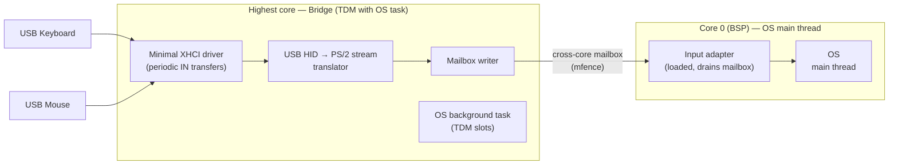
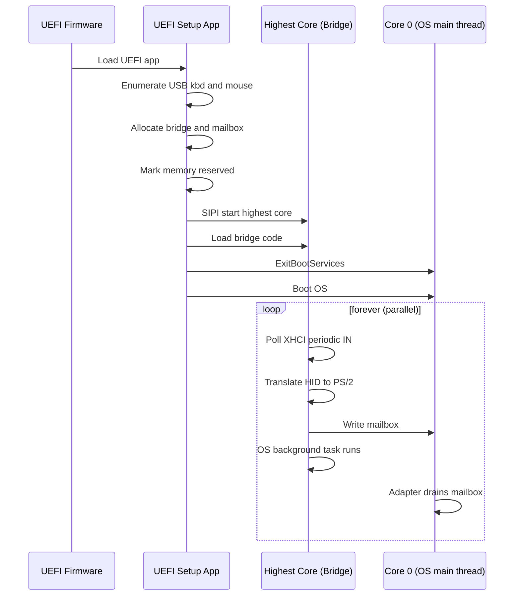

# USB HID → Polled Mailbox Bridge
## OS-Independent Architecture for USB Keyboard & Mouse on a PS/2-Only OS

**Document version:** 1.0 (final)
**Status:** Approved
**Author:** Principal Software Architect
**Target hardware:** Modern UEFI PC, exactly one USB keyboard + one USB mouse, fixed topology (no hotplug, no other USB devices ever)
**Scope:** OS-independent — any OS that implements the documented mailbox ABI can be loaded.

---

## 1. Problem Statement

A modern UEFI PC has only USB keyboard and mouse. We must run an OS whose input path
accepts a **polled serial keyboard/mouse interface** (PS/2-style byte stream), without
adding any USB code to that OS's source, and without modifying firmware.

The solution is a **standalone bridge** that runs on a dedicated CPU core, reads the USB
HID devices, translates their reports into a standard PS/2 byte stream, and delivers it
to the OS through a shared-memory mailbox. The OS consumes the mailbox through a small,
per-OS input adapter.

---

## 2. Requirements & Constraints

| # | Constraint | Implication |
|---|-----------|-------------|
| C1 | **No USB code in the OS codebase/source.** Code loaded into memory does not count as modifying the OS | USB code lives only in loaded components (the bridge). The OS source is untouched |
| C2 | Loadable on **any modern PC, including locked-down firmware** | No firmware reflash, no SMM install, no reliance on VT-x/AMD-V |
| C3 | **Minimal code** | Avoid a full USB stack; avoid 8042/PS-2 emulation, IRQ injection, and I/O-port trapping |
| C4 | OS input path may be adapted via a lightweight **polled serial** interface (non-USB) | A loaded input adapter polls a mailbox and feeds the OS's existing input handlers |
| C5 | **Standalone bridge** — runs in its own process/thread, separate from the OS | A distinct execution context, not code inside the OS |
| C6 | **XHCI ≥ 1.0 only** — the USB host controller must be an XHCI controller at spec version 1.0 or later | The bridge drives XHCI directly. No EHCI/UHCI/OHCI support. XHCI 1.0+ is universal on modern PCs. **Note:** this is about the *controller spec version*, not about USB 3.0 SuperSpeed — keyboards/mice are low/full-speed devices and never use SuperSpeed |

---

## 3. OS Independence

The bridge is **not** OS-specific. It presents a **standard, documented mailbox ABI** —
a "virtual serial keyboard/mouse interface" — that any OS can consume. The OS-specific
surface is limited to a small input adapter.

| Layer | OS-independent? | What it is |
|-------|-----------------|------------|
| **Bridge** (B1–B5, highest core) | ✅ Yes | Reads USB HID, translates to PS/2 Set 1 + PS/2 mouse packets, writes the mailbox. Knows nothing about the OS |
| **Mailbox ABI** (§6) | ✅ Yes | The formal interface contract: ring layout, byte-stream semantics, ordering. This is the "serial keyboard/mouse interface" any OS targets |
| **Core scheduling** (TDM slot on highest core) | ✅ Yes (mechanism) | The bridge occupies a periodic TDM slot on the highest core. Which OS task runs in the other slots is OS-specific, but the bridge does not care |
| **Input adapter** (O1/O2) | ❌ Per-OS | The small, swappable component that drains the mailbox and feeds the OS's own input handlers. One per OS |

**Key consequence:** to load a *different* OS, you do **not** touch the bridge, the
mailbox ABI, or the USB path. You only write a new **input adapter** (O1/O2) for that
OS. Everything else is reused unchanged.

**What "same serial keyboard/mouse interface" means:** the mailbox delivers a byte
stream in a fixed, documented format — PS/2 Set 1 scancodes for the keyboard, 3-byte
PS/2 packets for the mouse. Any OS whose input layer can be fed from a polled byte
stream of that format can be loaded.

**Per-OS adapter contract** — the three things each OS must provide:
1. **Reserve** the bridge + mailbox memory region so the OS never allocates over it
   (mechanism is OS-specific, e.g. an E820 carve-out).
2. **Leave the highest core available** to the bridge's TDM slot (or, on a single-core
   target, tolerate the TDM context switch on core 0).
3. A **polled reader** (O1) that drains the mailbox and **injects** bytes into the OS's
   input path (O2).

These three are the entire per-OS surface. Everything else is shared.

---

## 4. Architectural Decision

**The bridge runs on the highest-numbered core, time-division-multiplexed with the OS's
task on that core, while the OS's main thread runs on core 0.**

Because the target OS is SMP, the highest core already hosts a background task; the
bridge shares that core in its own TDM slots rather than trying to exclude it. This
gives the OS's main thread full, uninterrupted use of core 0. The bridge polls the USB
HID devices and writes input events into a cross-core mailbox that the input adapter on
core 0 drains.



### 4.1 Why this satisfies every constraint

- **C1 (no USB in OS codebase):** All USB code lives in the loaded bridge on the
  highest core. The OS source is untouched.
- **C2 (any PC, locked-down firmware):**
  - No firmware modification (no SPI reflash).
  - No SMM driver — SMRAM is locked on locked-down systems, so SMM is unusable.
  - No hypervisor — VT-x/AMD-V may be disabled, and it is the heaviest option.
  - Multi-core x86 is **universal** on modern PCs. Starting the highest core via SIPI
    is a standard CPU operation that firmware locking cannot prevent.
  - Secure Boot only affects *loading* the UEFI setup app (sign/enroll a key). The
    bridge itself runs after `ExitBootServices` and is not subject to Secure Boot.
  - XHCI ≥ 1.0 is **universal** on modern PCs (all USB 3.x controllers are XHCI 1.0+),
    so the C6 requirement does not meaningfully narrow the target set.
- **C3 (minimal code):** Fixed topology lets us enumerate once via UEFI and only do
  periodic IN transfers at runtime. Because the OS input path is a polled serial
  interface, we **do not** need to emulate the 8042/PS-2 controller, inject IRQs, or
  trap I/O ports.
- **C4 (polled serial interface):** The cross-core mailbox is the lightweight polled
  interface. The input adapter drains it and feeds the existing handlers.
- **C5 (standalone = own process/thread):** The bridge runs on the **highest core**,
  time-division-multiplexed with the OS's task on that same core. It is a separate
  execution context from the OS main thread (which stays on core 0), giving the bridge
  its own thread of control without stealing CPU from the main thread.
- **C6 (XHCI ≥ 1.0 only):** The bridge drives the XHCI controller directly. Restricting
  to XHCI ≥ 1.0 lets B1 target a single, well-defined controller interface (doorbell,
  TRB rings, event ring) with no EHCI/UHCI/OHCI code paths — a direct contributor to
  C3 (minimal code). **No USB 3.0 SuperSpeed support is needed:** keyboards and mice are
  low-speed (1.5 Mb/s) or full-speed (12 Mb/s) devices that always enumerate on the
  XHCI's USB 2.0 root-hub ports and use interrupt endpoints. The bridge only drives the
  two pre-discovered low/full-speed interrupt endpoints and never touches SuperSpeed.
  The XHCI ≥ 1.0 requirement is about the *controller interface version*, not about
  SuperSpeed — every modern XHCI controller is 1.0+ and handles both USB 2.0 and 3.0
  traffic, so this does not narrow the target set.

### 4.2 Why the highest core, not core 0

TDM on core 0 would steal time from the OS main thread on every tick. Putting the
bridge on the highest core and TDM-ing it with the background task there keeps core 0
entirely to the main thread. This is the core goal: give the main thread more breathing
room.

The bridge core is **not** reserved exclusively for the bridge — the OS's background
task continues to run there in its own TDM slots. Only the OS main thread is pinned to
core 0 and never runs on the bridge core.

**Mechanism:** the bridge owns the timer on the highest core. On each tick the ISR
switches between the bridge context and the OS task context (save/restore registers +
stack). Round-robin TDM with fixed slots gives the bridge guaranteed CPU time to poll
USB and drain into the mailbox, while the OS task keeps the rest.

**Single-core fallback:** if a target has only one core, the same TDM mechanism runs on
core 0, sharing with the OS main thread. Modern PCs are multi-core, so the highest-core
TDM design is the primary path.

### 4.3 Why the alternatives fail

| Option | Fails because |
|--------|---------------|
| SMM driver (Legacy-USB-style) | SMRAM locked on locked-down firmware; chipset-specific; cannot install after ReadyToLock |
| Hypervisor with virtual 8042 | Needs VT-x/AMD-V (may be disabled); heaviest; not bare metal |
| USB HID driver inside OS | Forbidden (C1) — would be an OS codebase change |
| External MCU → serial hardware | Needs a physical serial port (being removed from modern PCs); not pure software |
| UEFI runtime driver | Permissible under clarified C1, but runs on the BSP in the OS's context; not a standalone bridge (C5) |

---

## 5. System Architecture

### 5.1 Two-phase execution

**Phase 1 — Boot-time setup (UEFI application, before `ExitBootServices`):**
1. **Verify the host controller is XHCI ≥ 1.0 (C6).** Check the XHCI spec version
   (`HCSPARAMS1`/`HCCPARAMS` capability registers, or the `EFI_USB2_HC_PROTOCOL`
   revision). Abort cleanly if not XHCI ≥ 1.0 — no EHCI/UHCI/OHCI fallback.
2. Enumerate the single USB keyboard and single USB mouse using the standard UEFI USB
   stack (`EFI_USB2_HC_PROTOCOL` / `EFI_USB_IO_PROTOCOL`).
3. Record the fixed topology: device addresses, configurations, interfaces, and the
   interrupt IN endpoints for each device. **Done once** — no runtime enumeration.
4. Determine the core count (CPUID leaf 0xB / ACPI MADT) and pick the highest-numbered
   core as the bridge core.
5. Allocate the bridge code region and the cross-core mailbox page, and mark them
   `EFI_RESERVED_MEMORY_TYPE` in the EFI memory map so the OS will not allocate over them.
6. Set up the bridge core's GDT, stack, and page tables, load the bridge code, and start
   the core via SIPI. Load the input adapter into the reserved region on core 0.
7. Hand off to the bootloader / OS on the BSP (core 0).

**Phase 2 — Runtime (after `ExitBootServices`):**
- **Bridge (highest core, TDM with OS task):** runs in its own TDM time slot on the
  highest core — reads HID reports from the fixed endpoints via a minimal XHCI driver,
  translates to PS/2 scancodes / mouse packets, writes to the cross-core mailbox. The
  OS's background task runs on that core in the remaining slots.
- **Main input path (core 0):** the input adapter drains the mailbox and feeds the
  existing keyboard/mouse input handlers. The OS main thread keeps the full core 0.

### 5.2 Why the mailbox presents a "virtual PS/2 stream"

The input-side change is kept tiny by making the mailbox deliver data in the **exact
format the OS already expects**:
- **Keyboard:** PS/2 **Set 1** scancodes (make/break bytes).
- **Mouse:** PS/2 mouse packets (3 bytes: buttons + dx + dy).

The OS's existing scancode→key and mouse-packet→motion logic is reused **unchanged**.
Only the low-level byte source changes from the 8042 ports (`0x60`/`0x64`) to the
mailbox. This minimizes both the input-side change and the bridge-side translation
(HID→PS/2 Set 1 is a well-defined, small mapping table).

---

## 6. Interface Specification — Cross-Core Mailbox (the OS-agnostic ABI)

This is the **formal interface contract** that makes the solution OS-independent. Any
OS that implements a reader against this ABI can be loaded. The bridge is the producer;
the per-OS input adapter is the consumer. The ABI is fixed and versioned — the bridge
and the adapter must agree on it, but neither depends on the other's OS.

A pair of ring buffers in the reserved region, shared between the bridge core
(producer) and the input adapter on core 0 (consumer). **Keyboard and mouse each have
their own ring** — mirroring real PS/2's separate ports 0x60/0x64 — so the consumer
never has to disambiguate a keyboard scancode from a mouse packet. Lock-free
single-producer / single-consumer per ring. Because the bridge and the OS are on
**different cores**, ordering requires `mfence` (x86 is cache-coherent via MESI, so the
shared memory is coherent).

```c
#define MAILBOX_RING_SIZE  256

typedef struct {
    volatile UINT32 head;   /* producer (bridge core) write index */
    volatile UINT32 tail;   /* consumer (input adapter) read index */
    volatile UINT8  ring[MAILBOX_RING_SIZE];
} MAILBOX;
```

Two `MAILBOX` instances are published: one **keyboard ring** and one **mouse ring**.
The bridge writes keyboard scancodes only to the keyboard ring and mouse packets only
to the mouse ring; the adapter drains each independently.

**Producer (bridge core):**
```c
ring[head % MAILBOX_RING_SIZE] = byte;
mfence();                 /* ensure data visible before head update */
head++;
```

**Consumer (input adapter, core 0):**
```c
while (tail != head) {
    byte = ring[tail % MAILBOX_RING_SIZE];
    tail++;
    /* feed byte to the OS's keyboard or mouse handler */
}
```

**Byte stream semantics (virtual PS/2) — the "serial keyboard/mouse interface":**
- **Keyboard ring:** PS/2 **Set 1** scancodes, make and break (`0xE0`-prefixed extended
  codes included). The OS reuses its existing Set 1 decoder.
- **Mouse ring:** 3-byte packets `[buttons, dx, dy]` (two's-complement deltas), matching
  the standard PS/2 mouse packet the OS already parses.

Because the two device classes never share a ring, there is **no ambiguity**: a byte on
the keyboard ring is always a scancode, and a byte on the mouse ring is always part of a
mouse packet. (This removes the earlier single-ring design's collision, where keyboard
scancodes 0x01–0x07 — Esc and digits 1–6 — could be misread as mouse button bytes.)

**Ordering (cross-core):** The bridge (core N) and the input adapter (core 0) are on
different cores. x86 is cache-coherent (MESI), so the shared mailbox is coherent. The
`mfence` on the producer (before `head++`) and the `tail != head` check on the consumer
provide the required ordering. No interrupts, no locks.

**ABI stability rules (what makes it OS-independent):**
1. The mailbox layout, ring size, and byte-stream format are **fixed** and documented
   here. They do not change per OS.
2. The bridge never assumes anything about the OS — it only writes bytes to the rings.
3. The adapter never assumes anything about the bridge — it only reads bytes from the
   rings and injects them into its OS.
4. The mailbox base addresses are published by the boot-time UEFI app (e.g., fixed
   physical addresses or values passed to the OS at handoff). Each OS adapter reads
   these once at startup.

---

## 7. Module Breakdown & Code Tasks

### 7.1 Bridge (highest core, TDM with OS task) — OS-independent

| Module | Responsibility | Relative size |
|--------|----------------|---------------|
| **B1. XHCI periodic-IN driver** | Drive the XHCI controller directly (XHCI ≥ 1.0 only, per C6): doorbell, TRB rings, event ring, periodic interrupt IN transfers on the two pre-discovered **low/full-speed** endpoints. No SuperSpeed support, no enumeration, no hotplug, no interrupts | Largest (~300–600 LOC) |
| **B2. HID report parser** | Parse boot-protocol keyboard (8-byte report) and mouse (3-byte report) reports | Small |
| **B3. HID → PS/2 Set 1 translator** | Usage → Set 1 scancode table (make/break), mouse buttons/dx/dy → PS/2 packet | Small |
| **B4. Mailbox writer** | Cross-core lock-free ring-buffer producer (head index + `mfence`) | Tiny |
| **B5. Bridge core entry** | Bridge core entry point and TDM poll loop; runs in its own time slot on the highest core, sharing with the OS's background task | Tiny |

### 7.2 Input side — per-OS input adapter (NOT an OS source modification)

The input-side reader is a **separate loaded component**, not an edit to the OS
codebase. It is loaded into memory alongside the OS and hooks the OS's existing input
path (the same scancode/mouse-packet queue the OS's KBD driver already consumes). The
OS source is untouched. **This is the only OS-specific layer** — to load a different OS,
you write a new O1/O2 adapter for it; the bridge and ABI are unchanged.

| Module | Responsibility | OS-specific? | Relative size |
|--------|----------------|--------------|---------------|
| **O1. Mailbox reader** | Drain the cross-core mailbox (tail index) | No (identical for every OS) | Tiny |
| **O2. Input injection** | Feed drained scancodes/packets into the OS's existing KBD/mouse input queue | **Yes** (per-OS) | Tiny |

> **How O2 hooks in without editing source:** the adapter writes into the same in-memory
> input buffer/queue that the OS's existing keyboard/mouse handlers read. Because the
> OS is identity-mapped and its input structures live at known addresses, the adapter
> (loaded code) can locate and feed them directly. This is a loaded adapter, not a
> codebase change.

### 7.3 Boot-time (UEFI application) — OS-independent

| Module | Responsibility | Relative size |
|--------|----------------|---------------|
| **U1. USB topology discovery** | Verify host controller is XHCI ≥ 1.0 (C6); use UEFI USB stack to find kbd+mouse, record endpoints | Small |
| **U2. Highest-core bring-up** | Determine core count (CPUID leaf 0xB / ACPI MADT); set up the highest core's GDT, stack, page tables; start it via SIPI, loading the bridge code | Small |
| **U3. Memory reservation** | Allocate bridge + mailbox, mark reserved in EFI memory map | Tiny |

---

## 8. Boot Sequence



---

## 9. Risks & Verification

| Risk | Mitigation / Verification |
|------|---------------------------|
| OS overwrites bridge/mailbox RAM | Mark region `EFI_RESERVED_MEMORY_TYPE` **and** carve it out of the memory map the OS collects (e.g. E820 for TempleOS). Place bridge/mailbox above the OS's physical memory space so it never allocates over it |
| OS main thread uses the bridge core | The bridge **TDM-shares** the highest core with the OS's background task there — no need to exclude the core from the OS's core count. The main thread stays on core 0 and never runs on the bridge core |
| Highest-core bring-up fails | **Verify** SIPI sequence, GDT/stack/page tables for the AP; test in QEMU with multiple cores |
| XHCI periodic-IN without runtime enumeration | Enumerate once via UEFI (Phase 1); **verify** endpoint addresses remain valid after `ExitBootServices` |
| Secure Boot blocks UEFI app | Sign the app or enroll a key (deployment concern, not architectural) |
| Target lacks XHCI ≥ 1.0 | **Hard requirement (C6):** only XHCI ≥ 1.0 is supported. Verify the controller's spec version (XHCI `HCSPARAMS1`/`HCCPARAMS`, or the UEFI `EFI_USB2_HC_PROTOCOL` revision) at boot; abort cleanly if not XHCI ≥ 1.0. No EHCI/UHCI/OHCI fallback |
| Cross-core ordering bugs in mailbox | `mfence` producer; single-producer/single-consumer; unit-test on host |
| OS independence not preserved | The bridge + mailbox ABI are OS-agnostic (§3, §6). Only the O1/O2 adapter is per-OS. To load a new OS, write a new adapter — never touch the bridge or ABI. Verify the ABI is stable and versioned |

### 9.1 Reference verification (TempleOS)

The design was verified against the TempleOS source (`cia-foundation/TempleOS`) as the
reference consumer of the mailbox ABI:

- **Input path — CONFIRMED.** `Keyboard.HC` reads raw bytes from `KBD_PORT` (0x60) and
  converts them to scancodes via `NORMAL_KEY_SCAN_DECODE_TABLE` (**PS/2 Set 1**) with
  `0xE0` extended handling. `Mouse.HC` parses **3-byte packets** `[buttons, dx, dy]`
  with two's-complement sign handling. `KeyDev.HC` `PutKey(ch, sc)` is the input
  injection point. The virtual PS/2 stream design is consistent — only the byte source
  changes (0x60/0x64 → mailbox).
- **Multi-core — CONFIRMED SMP.** TempleOS is SMP (`mp_cnt`, `cpu_structs[]`,
  `CoreAPSethTask()` on every AP core, `JobQue`/`Spawn` with `target_cpu`). The bridge
  TDM-shares the highest core with the Seth task there; no `mp_cnt` exclusion needed.
- **Memory — PARTIALLY VERIFIED.** TempleOS boots via its own BIOS bootloader and
  collects the **E820** map, not the UEFI map. So `EFI_RESERVED_MEMORY_TYPE` alone is
  **not sufficient**; the region must also be carved out of E820 or placed above
  `mem_physical_space`.

**Testability — OS-free first, verified on real hardware:**

The strategy is to validate **everything except the final OS boot** without loading any
OS, and to verify **each layer on real hardware** — QEMU is for fast iteration, but real
hardware is the source of truth. The OS boot is the last, optional step; most of the
design is proven before it.

**Layer 0 — Host unit tests (no QEMU, no OS):**
- Mailbox ring buffer: producer/consumer correctness, wrap-around, `mfence` ordering,
  single-producer/single-consumer invariants. Run as pure C on the host.
- HID → PS/2 Set 1 translator: usage → scancode table, make/break, `0xE0` extended
  codes, mouse buttons/dx/dy → 3-byte packet. Run as pure C on the host.
- These cover B2, B3, B4, O1 logic entirely — no hardware, no OS.
- **Real hardware:** the mailbox and translator logic is hardware-independent, so host
  tests are authoritative here. No hardware step needed beyond confirming the host
  matches the target's x86 semantics (already true for x86-64).

**Layer 1 — UEFI app + bridge (no OS):**
- **QEMU/OVMF:** boot the UEFI setup app under OVMF. It enumerates the USB kbd/mouse,
  allocates and marks the bridge + mailbox reserved, and SIPI-starts the highest core
  with the bridge code.
- **OS-free validation:** instead of booting an OS, the app (or a tiny test harness on
  core 0) drains the mailbox and prints/asserts the received PS/2 byte stream. This
  proves the full USB → XHCI → HID → PS/2 → mailbox path end-to-end, with **no OS
  loaded**. Drive USB input via the QEMU monitor (`sendkey`, mouse events).
- **Real hardware (required):** boot the same UEFI app on a real PC with a real USB
  keyboard and mouse. This is the critical hardware validation — it exercises the real
  XHCI controller, real USB devices, real SIPI bring-up, and real multi-core TDM, none
  of which QEMU fully models. The harness on core 0 drains the mailbox and asserts the
  byte stream, exactly as in QEMU, but against real hardware.
- **UEFI → XHCI handoff (dedicated first test):** the bridge takes over the XHCI
  controller from UEFI in an unknown, partially-configured state. Re-configuring it
  (reset, rings, device contexts, doorbells) is the most failure-prone step, so the
  harness's first test case is specifically the handoff: it verifies the bridge reset
  the controller, re-established the device/endpoint context, and successfully polls
  the two endpoints. B1 records a **structured fault record** (`src/bridge/xhci_fault.h`)
  — stage, register snapshot (`USBSTS`/`USBCMD`/`CRCR`), completion code — so a handoff
  failure is diagnosed precisely (which step, what the controller said) rather than as
  a generic halt. This is where the open item (root-hub port number not recorded by U1)
  is confirmed/fixed on real hardware.
- **How the report is surfaced:** modern PCs have no physical serial port, so the UEFI
  console (ConOut) is the output channel. After the bridge is SIPI-started, the app calls
  `uefi_check_bridge_fault()` (`src/uefi/l1_harness.c`): it waits (bounded) for the bridge
  to publish its fault record, and if the record's magic is set, prints a compact
  diagnosis (stage, hint, `USBSTS`/`USBCMD`/`CRCR`) to the console and halts — it never
  boots the OS. The output fits the UEFI-guaranteed 80×25 console (mode 0), so it stays
  on one screen. If the bridge is healthy, the app proceeds to hand off to the OS.
- This covers B1, B2, B3, B4, B5, U1, U2, U3, and O1 — the entire bridge and boot-time
  path — without an OS, on both QEMU and real hardware.

**Layer 2 — Input adapter in isolation (no OS):**
- The O2 injection logic is the only OS-specific part. Test it against a **stub** that
  mimics the OS's input queue (a fake `PutKey`/KBD buffer), so the adapter's drain-and-
  inject behavior is validated without the real OS.
- This isolates O2 from the rest, so any OS-bring-up issue is not confused with an
  adapter bug.
- **Real hardware:** run the adapter + stub on the real PC (core 0) fed by the real
  bridge (Layer 1 hardware), confirming the adapter correctly drains the real mailbox
  and injects into the stub queue. This validates the adapter against real cross-core
  timing and ordering.

**Layer 3 — End-to-end OS boot (optional, final):**
- Only after Layers 0–2 pass on real hardware, boot the actual OS with USB-only input
  and confirm the input path works in the real OS.
- **Real hardware (required):** this is inherently a real-hardware test — boot the OS on
  the real PC with only the USB keyboard and mouse, and confirm input works.
- This is the only step that requires the OS, and it should be a formality if the
  earlier layers passed on real hardware.

**Summary:** Layers 0–2 validate the bridge, mailbox ABI, and adapter logic with **no
OS loaded**, and each layer is verified on **real hardware** (QEMU for fast iteration,
real hardware for confidence). The OS boot (Layer 3) is the final confirmation, not the
primary test vehicle.

---

## 10. Task Routing

| Task | Agent |
|------|-------|
| B1 XHCI periodic-IN driver | Firmware Coder |
| B2 HID report parser | Firmware Coder |
| B3 HID → PS/2 Set 1 translator | Firmware Coder |
| B4 Mailbox writer (cross-core) | Firmware Coder |
| B5 Bridge core entry / poll loop | Firmware Coder |
| U1 USB topology discovery | Firmware Coder |
| U2 Highest-core bring-up (SIPI/GDT/stack/page tables) | Firmware Coder |
| U3 Memory reservation | Firmware Coder |
| O1 Mailbox reader | Firmware Coder |
| O2 Input injection (per-OS adapter) | Firmware Coder |
| O1/O2 adapter for a second OS (portability demo) | Firmware Coder |
| GNU-EFI Makefile, linker script, PE32+ | Builder |
| Validate interface matches spec (§6) | Architect |
